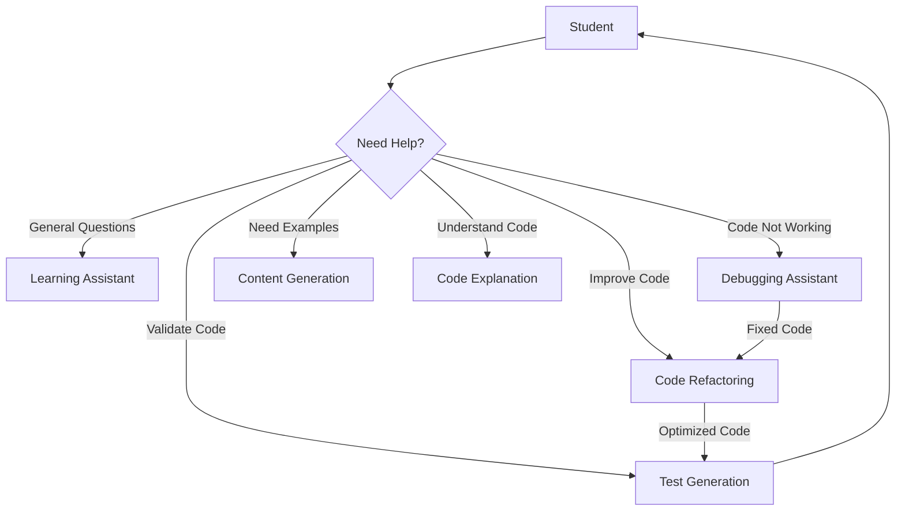

# 🤖 AI Agents Overview

This document outlines the specialized AI agents that power your interactive learning experience. Each agent has a specific role and can be accessed through dedicated slash commands in Cursor IDE.

## 🎯 Quick Reference

| Agent | Command | Purpose | When to Use |
|-------|---------|----------|------------|
| Learning Assistant | `/learn` | Guide your journey | Need direction or have general questions |
| Content Generation | `/generate` | Create learning content | Want examples or exercises |
| Debugging Assistant | `/debug` | Fix code issues | Code isn't working |
| Code Refactoring | `/refactor` | Improve code quality | Code works but needs improvement |
| Code Explanation | `/explain` | Understand code | Need to grasp concepts or logic |
| Test Generation | `/test` | Create test cases | Want to validate code |

## 🔄 Agent Workflow

## 🔄 Common Agent Workflows

### 1. Debug → Refactor → Test
1. Use `/debug` to fix errors
2. Use `/refactor` to improve the working code
3. Use `/test` to validate the changes

### 2. Learn → Generate → Explain
1. Use `/learn` to identify next topic
2. Use `/generate` to create practice exercises
3. Use `/explain` to understand solutions

### 3. Code Review Flow
1. Use `/explain` to understand existing code
2. Use `/refactor` to suggest improvements
3. Use `/test` to ensure changes work

## 🎯 Best Practices

1. **Command Selection**
   - Use `/debug` for errors only
   - Use `/explain` for understanding
   - Use `/refactor` for working code
   - Use `/test` for validation

2. **Code Selection**
   - Highlight minimal necessary code
   - Include relevant context
   - Select complete code blocks

3. **Follow-up**
   - Review suggestions carefully
   - Test changes thoroughly
   - Combine commands when needed

## 🔍 Agent Limitations

Each agent has specific constraints:
- Language support may vary
- Some suggestions need human review
- Complex tasks may require multiple commands
- Agents work best with clear, focused requests

## 🔄 Maintenance

The agents are maintained through:
1. Regular prompt updates
2. User feedback integration
3. Performance monitoring
4. Capability expansion

Remember: These agents are tools to enhance your learning. They work best when used appropriately for their intended purposes.