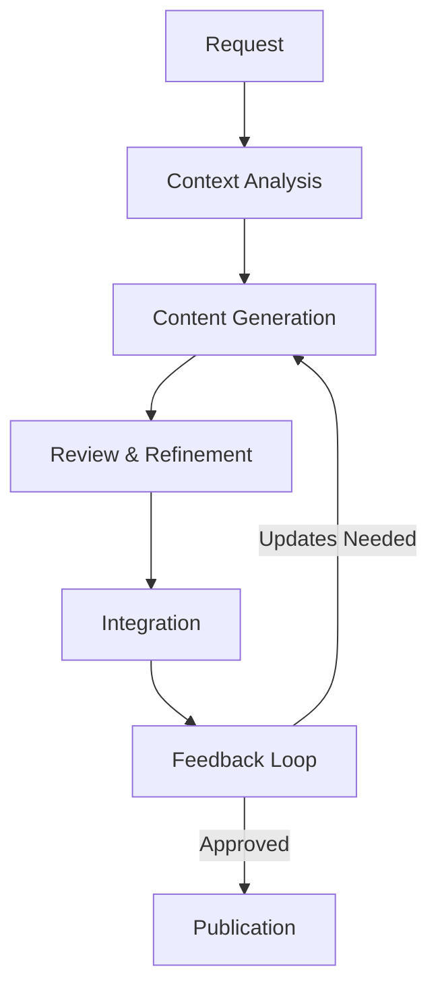

# 🔄 Content Generation Workflow

## Overview
This document outlines the step-by-step process for generating and reviewing educational content using AI assistance.

## 1. 📋 Request Phase

### Input Collection
1. Identify content type needed
2. Gather context and requirements
3. Review existing materials
4. Define specific objectives

### Template Selection
1. Choose appropriate prompt template
2. Fill in required fields
3. Add specific requirements
4. Include relevant references

## 2. 🔍 Context Analysis

### Documentation Review
1. Study related lessons
2. Review official documentation
3. Check style guides
4. Analyze similar content

### Requirement Analysis
1. Verify prerequisites
2. Confirm target audience
3. Check technical requirements
4. Identify potential challenges

## 3. ✍️ Content Generation

### Initial Draft
1. Use content generation prompt
2. Follow style guidelines
3. Include all required sections
4. Add visual elements

### Code Examples
1. Create working examples
2. Add comprehensive comments
3. Include error handling
4. Test all code

## 4. 🔎 Review & Refinement

### Technical Review
1. Verify accuracy
2. Test code examples
3. Check references
4. Validate prerequisites

### Style Review
1. Check formatting
2. Verify consistency
3. Review narrative flow
4. Assess readability

## 5. 🔗 Integration

### Content Placement
1. Add to appropriate directory
2. Update related files
3. Check cross-references
4. Verify links

### Documentation
1. Update indexes
2. Add metadata
3. Update navigation
4. Check file structure

## 6. 📝 Feedback Loop

### Collection
1. Gather reviewer feedback
2. Note technical issues
3. Track style concerns
4. Document suggestions

### Implementation
1. Address feedback
2. Make corrections
3. Update content
4. Verify changes

## 7. 📢 Publication

### Final Checks
1. Complete review checklist
2. Verify all links
3. Test all code
4. Check formatting

### Release
1. Update version numbers
2. Add to curriculum
3. Update documentation
4. Notify stakeholders

## Quality Assurance

### Technical Standards
- All code must be tested
- Examples must be complete
- References must be valid
- Prerequisites must be clear

### Style Standards
- Follow design guide
- Maintain consistency
- Use proper formatting
- Include visual aids

### Documentation Standards
- Clear instructions
- Complete references
- Proper metadata
- Updated indexes

## Tools & Resources

### Content Generation
- AI prompts
- Templates
- Style guides
- Reference materials

### Review Tools
- Code validators
- Markdown linters
- Link checkers
- Spell checkers

### Documentation
- Version control
- Documentation generators
- Diagram tools
- Format checkers

## Common Issues & Solutions

### Content Issues
- Incomplete examples → Add full context
- Unclear instructions → Add step-by-step details
- Missing prerequisites → Review and add requirements
- Broken code → Test and fix examples

### Style Issues
- Inconsistent formatting → Apply style guide
- Poor flow → Restructure content
- Missing visuals → Add diagrams/emojis
- Unclear explanations → Add examples

### Technical Issues
- Outdated references → Update documentation
- Broken links → Verify and fix
- Version conflicts → Specify requirements
- Integration problems → Check dependencies

## Best Practices

1. **Planning**
   - Start with clear objectives
   - Review existing content
   - Identify dependencies
   - Plan visual elements

2. **Generation**
   - Follow templates
   - Include all sections
   - Add visual aids
   - Test all code

3. **Review**
   - Technical accuracy
   - Style consistency
   - Completeness
   - User experience

4. **Maintenance**
   - Regular updates
   - Version control
   - Documentation
   - Feedback integration 