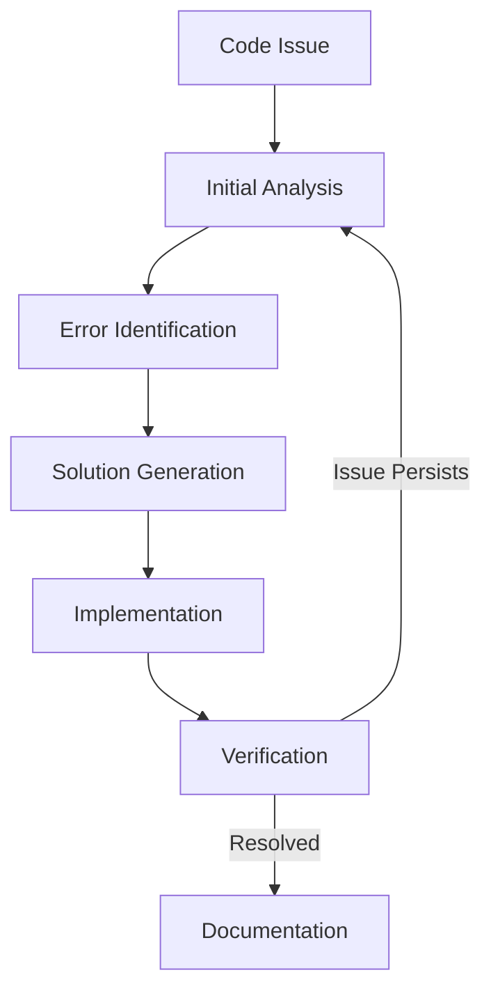

# 🔍 Debugging Workflow

## Overview
This document outlines the step-by-step process for debugging code using AI assistance.



## 1. 🔍 Initial Analysis

### Code Review
1. Examine error messages
2. Check syntax highlighting
3. Review code structure
4. Identify affected components

### Context Gathering
1. Check language version
2. Review dependencies
3. Verify environment
4. Note recent changes

## 2. 🐛 Error Identification

### Error Types
1. **Syntax Errors**
   - Missing punctuation
   - Incorrect indentation
   - Invalid syntax
   - Typos

2. **Runtime Errors**
   - Type mismatches
   - Undefined variables
   - Invalid operations
   - Memory issues

3. **Logical Errors**
   - Incorrect calculations
   - Wrong control flow
   - Off-by-one errors
   - Edge cases

### Analysis Tools
1. Error messages
2. Stack traces
3. Debugger output
4. Console logs

## 3. 🛠️ Solution Generation

### Approach
1. Identify root cause
2. Consider alternatives
3. Check documentation
4. Test solutions

### Solution Types
1. **Quick Fixes**
   - Syntax corrections
   - Simple replacements
   - Minor adjustments

2. **Structural Changes**
   - Code reorganization
   - Logic improvements
   - Error handling

3. **Prevention Measures**
   - Input validation
   - Error handling
   - Testing
   - Documentation

## 4. ✨ Implementation

### Steps
1. Apply changes
2. Add comments
3. Update related code
4. Add error handling

### Best Practices
1. Make minimal changes
2. Test each change
3. Document updates
4. Maintain style

## 5. ✅ Verification

### Testing
1. Run unit tests
2. Check edge cases
3. Verify functionality
4. Test performance

### Validation
1. Review changes
2. Check style
3. Verify fixes
4. Test integration

## 6. 📝 Documentation

### Updates
1. Add comments
2. Update docs
3. Note changes
4. Share solutions

### Learning
1. Record issue
2. Document solution
3. Share knowledge
4. Update guides

## Common Issues & Solutions

### 1. Syntax Problems
- Missing colons
- Incorrect indentation
- Unclosed brackets
- Wrong quotes

### 2. Runtime Issues
- Type errors
- Null references
- Memory problems
- Stack overflow

### 3. Logic Errors
- Wrong operators
- Incorrect loops
- Bad conditions
- Data issues

## Best Practices

### 1. Prevention
- Use linters
- Write tests
- Add validation
- Document code

### 2. Debugging
- Use print statements
- Check logs
- Step through code
- Test assumptions

### 3. Documentation
- Comment fixes
- Update docs
- Share solutions
- Record patterns

## Tools & Resources

### Debugging Tools
- IDE debuggers
- Print statements
- Logging
- Profilers

### Documentation
- Error guides
- Language docs
- Stack Overflow
- Community forums

### Testing
- Unit tests
- Integration tests
- Manual testing
- Automated checks

## Response Templates

### Error Report
```markdown
## Error Details
- Type: [Error Type]
- Location: [File/Line]
- Message: [Error Message]
- Context: [What happened]

## Solution
1. [Step-by-step fix]
2. [Verification steps]
3. [Prevention tips]
```

### Fix Verification
```markdown
## Changes Made
- [What changed]
- [Why it works]
- [Side effects]

## Testing
1. [Test cases]
2. [Results]
3. [Coverage]
```

## Quality Standards

### Code Quality
- Follows style guide
- Proper formatting
- Clear comments
- Error handling

### Documentation
- Clear explanations
- Code examples
- References
- Updates

### Testing
- Unit tests
- Edge cases
- Integration
- Performance 